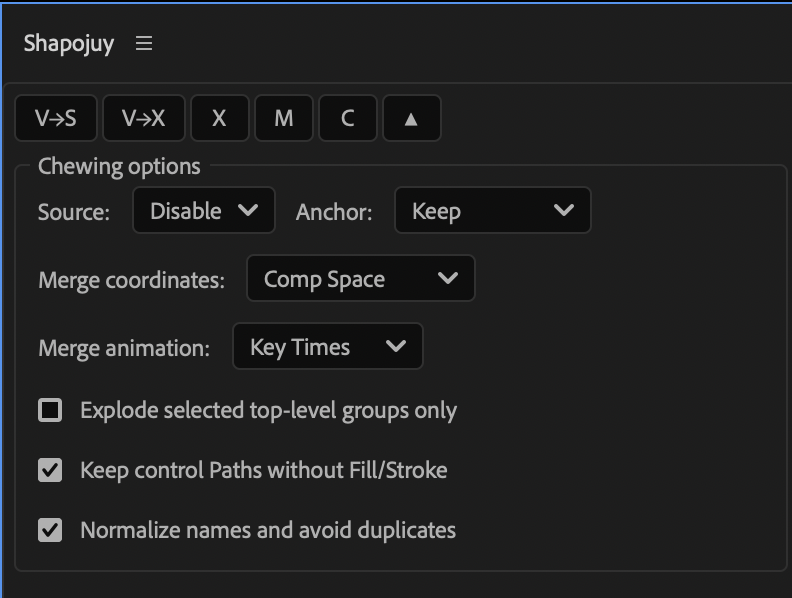

# Shapojuy

Compact shape-layer toolbox for Adobe After Effects 2026.

Компактный набор инструментов для Shape Layers в Adobe After Effects 2026.



## Documentation / Документация

- [Русский гайд](README_RU.md)
- [English guide](README_EN.md)

## Download / Скачать

Download the ready-to-install `Shapojuy.jsx` from the [latest GitHub Release](https://github.com/motionxamon/shapojuy/releases/latest).

Скачайте готовый `Shapojuy.jsx` из [последнего релиза GitHub](https://github.com/motionxamon/shapojuy/releases/latest).

## Controls / Кнопки

| Button | Action |
| --- | --- |
| `V→S` | Vector → Shapes |
| `V→X` | Vector → Explode |
| `X` | Explode |
| `M` | Merge |
| `C` | Clean |
| `⚙` | Settings / Настройки |

Current release: **1.0.2**

---

# Русский гайд

## Скачать и установить

1. Откройте [последний релиз](https://github.com/motionxamon/shapojuy/releases/latest).
2. В разделе **Assets** скачайте `Shapojuy.jsx`.
3. Закройте After Effects.
4. Скопируйте файл в папку ScriptUI Panels.

macOS:

```text
/Applications/Adobe After Effects 2026/Scripts/ScriptUI Panels/
```

Windows:

```text
C:\Program Files\Adobe\Adobe After Effects 2026\Support Files\Scripts\ScriptUI Panels\
```

5. Запустите After Effects.
6. Откройте `Window → Shapojuy`.
7. Пристыкуйте панель и сохраните Workspace.

## Как пользоваться

### `V→S` — Vector → Shapes

Выделите один или несколько AI, EPS, PDF или SVG-слоёв на Timeline и нажмите `V→S`. Shapojuy последовательно конвертирует их в нативные Shape Layers.

### `V→X` — Vector → Explode

Выделите векторные слои и нажмите `V→X`. Скрипт сначала конвертирует их, затем сразу разбивает результат на отдельные непустые Shape Layers.

### `X` — Explode

Выделите один или несколько Shape Layers и нажмите `X`. Каждая верхнеуровневая группа с геометрией станет отдельным слоем. Пустой мусор после Illustrator будет пропущен.

### `M` — Merge

Выделите минимум два Shape Layer и нажмите `M`. Содержимое будет объединено в один Shape Layer с отдельной внутренней группой для каждого исходника. Для Position, Scale, Rotation, Skew и Opacity рассчитывается трансформация относительно итогового слоя, включая двумерные parent-цепочки и Null-объекты. Имя итогового слоя собирается из имён объединённых Shape Layers; слово `Shapojuy` в имя не добавляется.

### `C` — Clean

Выделите Shape Layers и нажмите `C`. Скрипт удалит пустые вложенные группы, найдёт пустые слои и нормализует стандартные имена.

### `⚙` — настройки

Показывает или скрывает настройки. Все операции запускаются сразу: Shapojuy не показывает модальные подтверждения или отчёты.

## Настройки

### Source

- `Keep` — оставить исходники.
- `Disable` — выключить исходники после успешной операции.
- `Archive` — выключить исходники, включить Shy и добавить архивный комментарий.
- `Delete` — удалить исходники.

### Anchor

- `Keep` — оставить Anchor Point как есть.
- `Visual Center` — поставить Anchor Point в центр видимой графики без её смещения.
- `Comp` — поставить Anchor Point в центр композиции без смещения графики.

### Merge coordinates

- `Comp Space` — координаты композиции; универсальный режим.
- `Common Parent` — сохранить общего двумерного родителя.
- `First Layer` — использовать первый/верхний Shape Layer как систему координат.

### Merge animation

- `Off` — сохранить только текущий кадр.
- `Key Times` — измерить трансформации на существующих ключах исходников и родителей.
- `Every Frame` — измерить каждый кадр для максимального совпадения сложной анимации.

### Дополнительные флаги

- `Output suffix` — необязательный суффикс для новых Shape Layers. Пустое поле оставляет исходные имена групп и объединяемых слоёв. Для `_v2` получится `Group_v2`, для `outline` — `Group outline`.
- `Explode selected top-level groups only` — обрабатывать только выделенные группы верхнего уровня.
- `Keep control Paths without Fill/Stroke` — сохранять невидимые управляющие Paths.
- `Normalize names and avoid duplicates` — исправлять стандартные имена и не допускать совпадений.

## Ограничения

- Merge работает с двумерными Shape Layers и двумерными parent-цепочками.
- 3D-слои и 3D-родители не поддерживаются.
- Effects, Masks, Layer Styles и Track Mattes нельзя независимо упаковать во внутренние Shape Groups.
- При сложной parent-анимации используйте `Every Frame`.

[Полное руководство на русском](README_RU.md)

---

# English guide

## Download and install

1. Open the [latest release](https://github.com/motionxamon/shapojuy/releases/latest).
2. Download `Shapojuy.jsx` from **Assets**.
3. Close After Effects.
4. Copy the file into the ScriptUI Panels directory.

macOS:

```text
/Applications/Adobe After Effects 2026/Scripts/ScriptUI Panels/
```

Windows:

```text
C:\Program Files\Adobe\Adobe After Effects 2026\Support Files\Scripts\ScriptUI Panels\
```

5. Restart After Effects.
6. Open `Window → Shapojuy`.
7. Dock the panel and save the workspace.

## Usage

### `V→S` — Vector → Shapes

Select one or more AI, EPS, PDF, or SVG layers in the Timeline and click `V→S`. Shapojuy converts them sequentially to native Shape Layers.

### `V→X` — Vector → Explode

Select vector layers and click `V→X`. Shapojuy converts the footage and immediately explodes each result into separate non-empty Shape Layers.

### `X` — Explode

Select one or more Shape Layers and click `X`. Each top-level geometry group becomes a separate layer; empty Illustrator debris is skipped.

### `M` — Merge

Select at least two Shape Layers and click `M`. Their contents are combined into one Shape Layer with a separate internal group for every source. Position, Scale, Rotation, Skew, and Opacity are calculated relative to the result, including supported 2D Null-parent chains. The output layer name is built from the merged Shape Layer names; `Shapojuy` is never inserted into the layer name.

### `C` — Clean

Select Shape Layers and click `C`. Shapojuy removes empty nested groups, detects empty layers, and normalizes generic names.

### `⚙` — Settings

Shows or hides all options. Operations run immediately without modal confirmations or result dialogs.

## Settings

### Source

- `Keep` — retain source layers.
- `Disable` — disable sources after a successful operation.
- `Archive` — disable and shy sources, and add an archive comment.
- `Delete` — remove source layers.

### Anchor

- `Keep` — preserve the original Anchor Point.
- `Visual Center` — center the Anchor Point on visible artwork without moving it.
- `Comp` — move the Anchor Point to the composition center without moving the artwork.

### Merge coordinates

- `Comp Space` — use composition coordinates.
- `Common Parent` — preserve a shared 2D parent.
- `First Layer` — use the first/top Shape Layer as the coordinate system.

### Merge animation

- `Off` — preserve the current frame only.
- `Key Times` — sample transforms at existing source and parent key times.
- `Every Frame` — sample every frame for the closest match with complex animation.

### Additional options

- `Output suffix` — optional suffix for newly created Shape Layers. Leave it empty to keep source group/layer names. `_v2` produces `Group_v2`; `outline` produces `Group outline`.
- `Explode selected top-level groups only` — process selected top-level groups only.
- `Keep control Paths without Fill/Stroke` — retain invisible control paths.
- `Normalize names and avoid duplicates` — clean generic names and avoid collisions.

## Limitations

- Merge supports 2D Shape Layers and 2D parent chains.
- 3D layers and 3D parents are not supported.
- Effects, Masks, Layer Styles, and Track Mattes cannot be preserved independently inside internal Shape Groups.
- Use `Every Frame` for complex parent animation.

[Full English documentation](README_EN.md)
